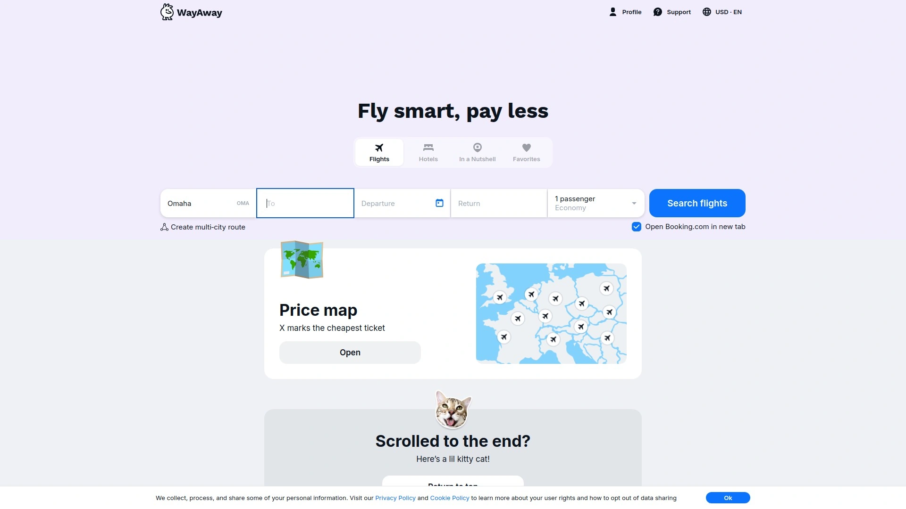
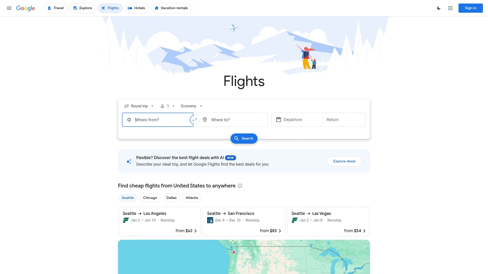
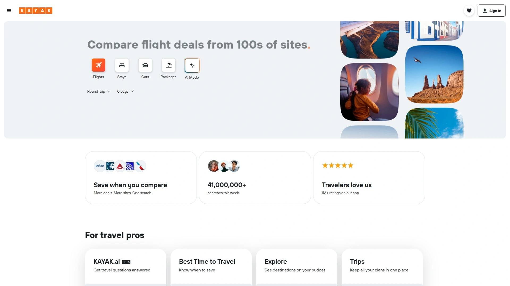
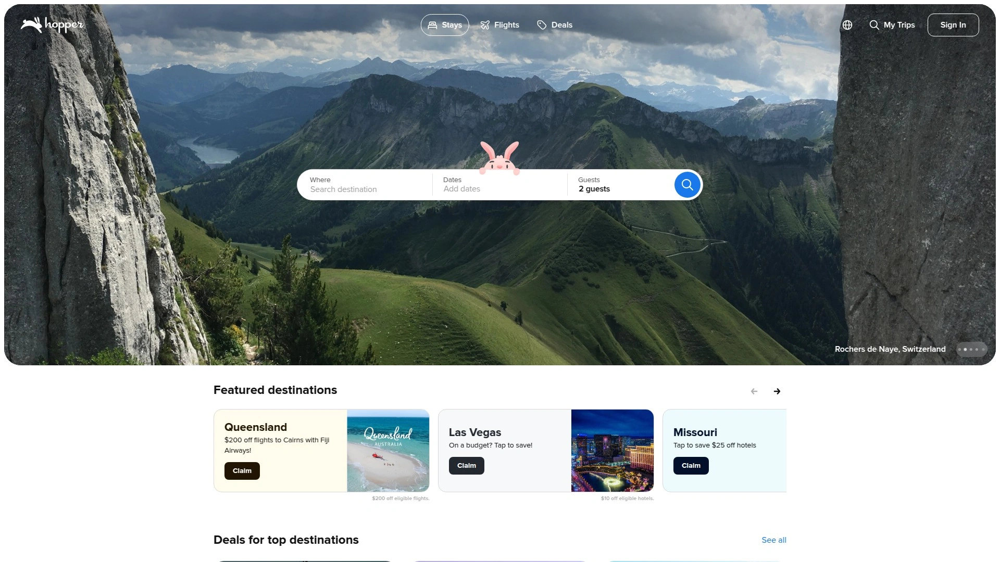
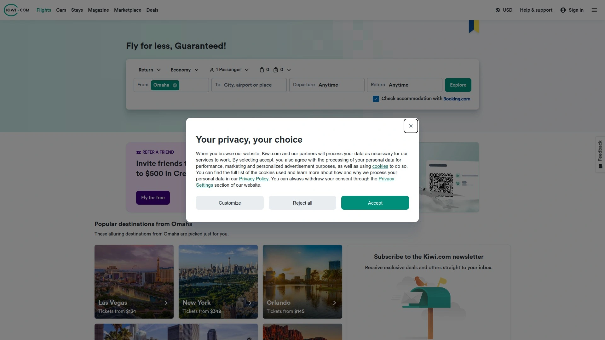
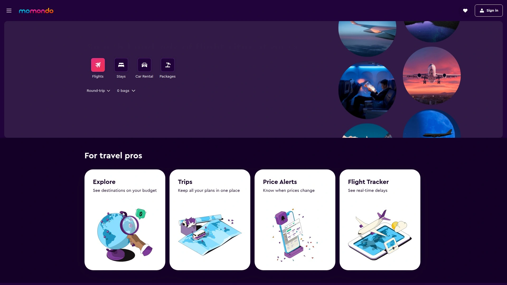
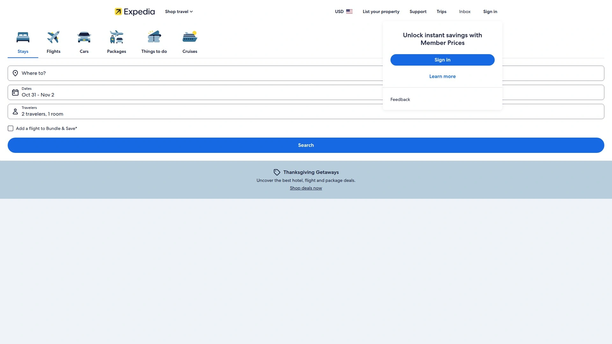
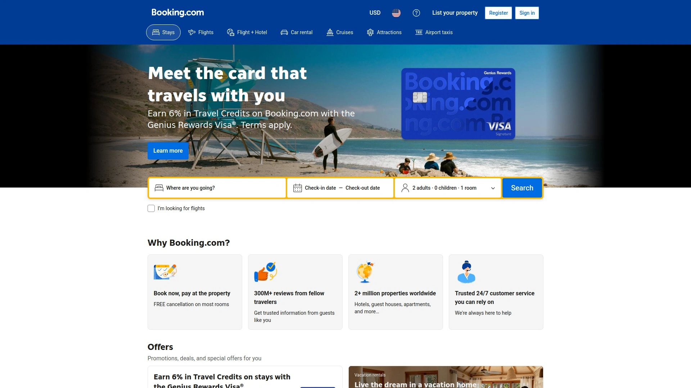
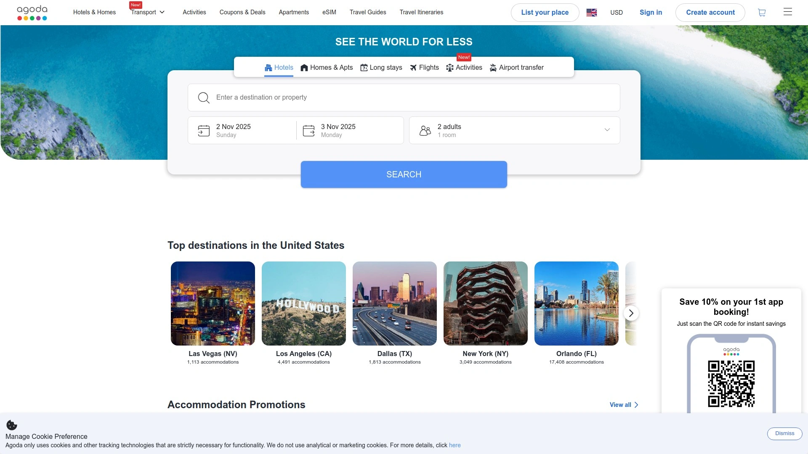

# 2025: 10 Top-Tier Travel Booking Platforms You Must Know

Finding cheap flights and hotels shouldn't feel like solving a puzzle blindfolded. Travel booking platforms have evolved from simple search engines into sophisticated tools that scan thousands of options, predict price trends, and reward loyalty without demanding your firstborn child in fees. Whether you're chasing mistake fares to Europe, hunting for last-minute beach getaways, or planning a complex multi-city adventure, the right platform saves you hours of frustration and hundreds of dollars per trip.

***

## **[WayAway](https://wayaway.io)**

All-in-one travel search with real-money rewards on every booking.

WayAway functions as a comprehensive flight metasearch engine that aggregates prices from over 728 airlines and booking agencies, giving you a single view of every available option for your dates and route. The platform doesn't sell tickets directly—instead, it redirects you to the airline or agency website to complete your purchase, keeping the entire process transparent.

What sets WayAway apart is the membership program called WayAway Plus, which provides cashback on bookings across flights, hotels, car rentals, and activities. Members receive up to 15% back on travel purchases, paid out as actual money rather than points locked into a single ecosystem. The cashback processing takes 30-90 days to confirm but applies across all travel categories including hotels from Booking.com, activities through GetYourGuide and Viator, and airport transfers via KiwiTaxi.

The platform includes flexible date search that displays prices for multiple days around your preferred travel dates, helping identify the cheapest days to fly. Price alerts notify you when fares drop on specific routes. Multi-city search handles complex itineraries with multiple stops, particularly useful for European tours or cruise embarkations. The "Explore" feature lets you search destinations based on interests like adventure, culture, or relaxation rather than specific cities.

User reviews highlight the clean interface that makes travel planning straightforward, transparent pricing with no hidden fees, and the ability to organize flights, accommodations, and activities through a single platform. Some users mention that prices display exclusively in US dollars, requiring mental conversion for international travelers, and that the most valuable features require the paid membership.

**Best for travelers who want cashback on all travel spending, prefer organizing entire trips through one platform, and appreciate transparent pricing without hidden booking fees.**

---

## **[Google Flights](https://www.google.com/travel/flights)**

Lightning-fast search with the cleanest interface in the business.

Google Flights delivers results in under two seconds thanks to direct connections with airline pricing systems. The speed advantage becomes obvious when you're testing multiple date combinations or comparing various airports—other platforms lag while Google Flights has already shown you a dozen options. The interface contains zero ads, just pure functionality focused on getting you information fast.

The calendar view shows price trends across an entire month at a glance, making it instantly clear which days cost less. Historical price data for each route helps you understand whether current fares sit above or below typical pricing. Price tracking sends email alerts when fares change for routes you're monitoring, though it requires booking directly with airlines rather than through third-party agents.

The "Explore" map lets you enter your departure city and see flight prices to destinations worldwide, perfect for flexible travelers chasing deals. Filter options sort by departure time, number of stops, airline preference, and baggage policies. The route insights feature explains why certain fares cost more, noting factors like demand spikes or limited availability.

Weaknesses include limited coverage of budget airlines, no package deals combining flights and hotels, and missing some regional carriers that smaller platforms capture. Google Flights prioritizes major airlines and established routes, which means deep discount carriers sometimes slip through the cracks.

**Ideal for domestic US travel, price tracking on major airlines, quick comparison shopping, and anyone who values speed plus accuracy over exhaustive budget carrier coverage.**

***

## **[Skyscanner](https://www.skyscanner.com)**

The budget hunter that finds hidden deals competitors miss.

Skyscanner built its reputation by surfacing budget airline fares that other platforms overlook. Testing across 500+ routes showed Skyscanner found the cheapest price 78% of the time, outperforming both Google Flights and Kayak on absolute lowest fares. The platform excels at international travel, particularly European routes where budget carriers dominate.

The "Everywhere" search feature answers the question "where can I afford to go?" by showing the cheapest destinations from your departure city. Monthly view displays which months offer the lowest fares for specific routes, helping you plan around deals rather than forcing specific dates. Multi-city trip planning handles complex routing that single-segment searches can't address.

Skyscanner functions purely as a comparison tool, redirecting to external booking sites rather than processing transactions itself. This sometimes means dealing with third-party vendors like Kiwi.com or Dohop if issues arise, since airlines typically don't assume responsibility for reservations made through intermediaries. The interface feels less modern than Google Flights or Hopper, though functionality remains solid.

The platform offers transparent pricing without hidden fees, showing exactly what you'll pay before redirecting to the booking site. Coverage includes over 1,200 airlines and travel agents, providing genuinely comprehensive results for international routes. Price alerts track specific routes and notify you when fares drop to your target price.

**Perfect for international travel, European routes, budget-conscious travelers who prioritize cheapest price above all else, and flexible explorers hunting destination inspiration.**

***

## **[Kayak](https://www.kayak.com)**

The feature powerhouse with AI predictions and package deals.

Kayak searches over 600 airlines and travel sites simultaneously, delivering the most comprehensive results available. The platform stands out for advanced filtering that lets you customize searches by airline alliance, aircraft type, airport preference, layover duration, and even specific seat availability. No other platform offers this level of granular control over search parameters.

Price forecasting uses AI to predict whether fares will rise or fall over the next seven days, recommending whether to book now or wait. Historical data shows how current prices compare to average fares for the same route and dates. The flexible date matrix displays prices across a range of dates, making it easy to spot patterns and choose optimal travel days.

Package deals combine flights and hotels at discounted bundled rates, often saving 10-20% compared to booking separately. The mobile app provides excellent on-the-go functionality with push notifications for price changes. Kayak Hacker Fares combine one-way tickets from different airlines to create cheaper round trips than booking directly.

Downsides include slower loading times (5-8 seconds versus Google's under 2 seconds), cluttered interface with ads that distract from results, and occasional expired deals that show in search but aren't actually available. The comprehensive nature creates complexity that overwhelms users who just want simple answers.

**Best for complex travel requirements, package deals, travelers who want maximum customization, power users comfortable with advanced features, and anyone booking multi-airline itineraries.**

***

## **[Hopper](https://hopper.com)**

Price prediction accuracy plus the ability to freeze fares you're not ready to book.

Hopper has helped over 100 million travelers find and secure the best prices on flights, hotels, homes, and car rentals. The platform analyzes historical data and claims 95% accuracy when predicting the best time to book up to one year in advance. You search your preferred route and dates, then Hopper tells you whether to book now or wait based on price trend analysis.

The color-coded deals calendar makes finding the cheapest travel dates visual and instant. Simply glance at the calendar and darker colors indicate higher prices while lighter shades show deals. This visual approach beats scrolling through endless date combinations on other platforms.

Hopper's unique "Price Freeze" feature lets you lock a fare for a small fee while you finalize plans or wait for your next paycheck. If the price increases, you pay only the frozen rate. If it decreases, you automatically pay the lower amount. This removes the anxiety of watching prices fluctuate while you're still coordinating with travel companions or checking work schedules.

The app (functionality is limited on the website) includes travel disruption guarantees, instant rebooking without extra costs if flights get delayed, and 24/7 customer support. Optional "Cancel for Any Reason" plans add flexibility to traditionally non-refundable bookings.

**Ideal for budget-conscious travelers who can be flexible with dates, anyone who wants data-driven booking recommendations, and people who need time to finalize plans without losing a good fare.**

***

## **[Kiwi.com](https://www.kiwi.com)**

Unique route combinations that don't exist anywhere else.

Kiwi.com's proprietary "Kiwi-Code" technology combines routes and deals from airlines that don't normally have partnerships, creating itineraries impossible to find on other platforms. This means booking a trip with three different budget carriers for less than a single legacy airline would charge, even though those carriers have no formal connection.

The NOMAD feature calculates every possible route combination when you want to visit multiple cities but remain flexible about the order. Enter your origin city, list destinations you want to visit, specify how long to stay in each place, and NOMAD finds the cheapest possible sequence. This travel hack exists only on Kiwi.com and saves serious money on complex multi-city trips.

Flexible search lets you find cheap flights without specifying a destination—just enter your departure location and select "Anywhere" to see the cheapest routes. The map search displays destinations and prices as you zoom and pan, highlighting best deals in green. This visual discovery beats typing random city names into other platforms hoping for deals.

The trade-off involves booking through Kiwi.com as a third-party rather than directly with airlines, which complicates support if issues arise during travel. Some bookings include Kiwi.com fees on top of base fares. However, the unique routing options often save enough to justify any added complexity for savvy travelers.

**Perfect for multi-city trips, flexible travelers open to creative routing, budget maximizers willing to piece together multiple carriers, and adventurers using the map to discover affordable destinations.**

***

## **[Momondo](https://www.momondo.com)**

Vibrant interface with extensive filters and price drop alerts.

Momondo aggregates information from numerous travel sites and airlines, making it easy to find the best deals in one search. The colorful design and user-friendly interface enhance the experience by making navigation intuitive and enjoyable. While some platforms feel utilitarian, Momondo brings visual personality to flight comparison.

The platform provides robust tools for managing flight, hotel, and tour comparisons. Users can set up price drop alerts for specific routes or accommodations, ensuring they never miss deals. Insightful statistics regarding fare trends over time help travelers decide when to book trips effectively.

Coverage includes hundreds of airlines and online travel agents with transparent comparison showing which booking site offers the lowest price. The flexible search options let you explore date ranges, nearby airports, and alternative routing to maximize savings. Filter options sort by price, duration, number of stops, and airline preference.

Some users report occasional price discrepancies between what Momondo displays and actual costs on airline websites, so confirming prices before booking remains important. The platform functions as a metasearch engine rather than a booking agent, redirecting you to external sites to complete purchases.

**Great for travelers who appreciate visual design, international route comparison, price alert tracking, and exploring multiple booking options in a single colorful interface.**

***

## **[Expedia](https://www.expedia.com)**

Established online travel agency with package deals and rewards.

Expedia operates as a full-service online travel agency that's been around since the 1990s, offering flights, hotels, car rentals, cruises, and vacation packages. The platform books directly rather than redirecting to external sites, handling customer service and changes through its own support system.

Package deals that bundle flights and hotels together often save money compared to booking components separately. The Expedia Rewards program lets members earn points on bookings that can be redeemed for future travel. Testing across multiple routes showed Expedia competitive on pricing, particularly for domestic US flights.

The interface provides straightforward search and booking with clear pricing breakdown showing base fares, taxes, and any additional fees. Customer service accessibility beats third-party aggregators since Expedia controls the entire transaction. The mobile app syncs itineraries and travel documents for easy access during trips.

Downsides include less competitive pricing on international routes compared to budget-focused platforms like Skyscanner or Kiwi.com. The site sometimes shows higher fares than booking directly with airlines. Expedia prioritizes established carriers over ultra-budget airlines that platforms like Skyscanner surface.

**Best for travelers who want one-stop booking with direct customer service, package deal savings, rewards program benefits, and prefer established brands over smaller aggregators.**

***

## **[Booking.com](https://www.booking.com)**

Massive global hotel selection with flexible cancellation options.

Booking.com operates in over 220 countries with more than 28 million listings covering hotels, resorts, vacation homes, apartments, villas, and unusual stays like treehouses and boats. The sheer scale means finding accommodations for virtually any destination and budget. The platform focuses primarily on lodging rather than flights, though flight booking exists.

Free cancellation on most hotel bookings provides flexibility to change plans without penalties. This risk-free approach lets travelers book early to lock in properties, then cancel if better options appear or plans shift. The 24/7 customer support in 40+ languages helps resolve issues regardless of time zone or location.

The user interface offers extensive filtering and sorting options to find perfect accommodations. Interactive map view shows property locations relative to attractions, transit, and city centers. Detailed property information includes photos, amenities, reviews, and exact cancellation policies.

Commission rates for properties range 15-25% depending on location and property type. The platform attracts both business and leisure travelers across all price points. Promotions and deals help properties attract more bookings through temporary discounts.

**Ideal for international hotel bookings, travelers who value free cancellation, anyone seeking diverse accommodation types, and users who prioritize massive selection over flight comparison.**

***

## **[Agoda](https://www.agoda.com)**

Strong Asian market presence with loyalty rewards and best price guarantee.

Agoda offers over 2 million listings across 200+ countries with particularly strong coverage in Asia. The platform excels for travelers focusing on destinations in Thailand, Japan, China, Vietnam, and throughout Southeast Asia where its partnerships run deepest. Properties range from budget options to five-star luxury including hotels, apartments, villas, and unique stays.

The "Best Price Guarantee" attracts price-conscious travelers by promising to match lower rates found elsewhere. AgodaCash loyalty program lets guests earn rewards on bookings that apply toward future reservations. This creates incentive to book repeatedly through the platform rather than shopping around.

The interface emphasizes visuals and property details with clean navigation. Various filters and sorting options help travelers find suitable accommodations quickly. Interactive map view helps visualize property locations. Customer support operates 24/7 through phone, email, and live chat.

Commission rates typically fall between 15-25% depending on property and location. Testing shows Agoda had the best hotel rates globally 34% of the time, outperforming Booking.com and Priceline. The focus remains on accommodations rather than flights or complete trip planning.

**Perfect for Asian travel, hotel-focused bookings, loyalty program members, and price-conscious travelers who want guaranteed best rates backed by matching policies.**

***

## FAQ

**Do these platforms charge booking fees on top of ticket prices?**

It varies by platform. Google Flights redirects to airlines so you pay what airlines charge directly with no additional fees. Kiwi.com and some third-party sites add their own booking fees ranging from $10-30 per ticket. WayAway functions as a metasearch that redirects to booking sites, so fees depend on where you complete the purchase. Always check the final price breakdown before confirming—legitimate platforms show all fees clearly in the checkout summary. If fees aren't transparent, that's a red flag.

**Can you really trust price predictions from Hopper and Kayak?**

Hopper claims 95% accuracy on its predictions based on historical data analysis. Testing shows the predictions generally point you in the right direction more often than not, though no algorithm is perfect. Kayak's price forecasting similarly uses historical trends to predict seven-day movement. Both tools work best for popular routes with lots of data. For obscure routes with limited historical pricing, predictions become less reliable. Treat them as helpful guidance rather than guaranteed outcomes.

**Which platform actually finds the cheapest flights most often?**

Testing across 500+ routes showed Skyscanner found the lowest price 78% of the time, making it the budget champion. However, Google Flights offers the fastest and most accurate results for major carriers, while Kiwi.com surfaces unique route combinations that can undercut everyone else through creative routing. The smart approach involves checking your top two or three platforms for important bookings, since different platforms excel on different routes. For quick domestic searches, Google Flights wins. For international budget hunting, start with Skyscanner.

***

## Wrap Up

The travel booking platforms above each bring different strengths to flight and hotel comparison. Power users often check multiple platforms for major trips since pricing varies by route and booking source. [WayAway](https://wayaway.io) stands out for travelers who want comprehensive search across 728+ airlines combined with cashback rewards on all travel purchases including flights, hotels, activities, and car rentals. The single-platform approach streamlines trip planning while the membership program returns actual money rather than points locked into restrictive ecosystems, making it particularly valuable for frequent travelers booking multiple trip components throughout the year.
